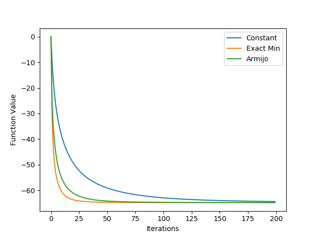

# Gradient Descent for Convex Quadratic Function

Gradient descent is a first-order iterative optimization algorithm for finding a local minimum of a differentiable function.

## Method

3 different gradient descent method are implmented:

- Constant Step Size: Gradient descent with fixed step size 0.3

- Exact Line Search: Gradient descent with exact line search is a variant of gradient descent where we perform an exact line search along the line of the gradient vector to move to the point of global minimum along that line.

- Armijo: Gradient descent with Armijo rule

## Performence

